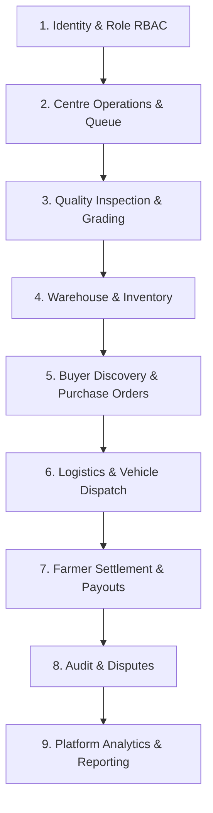

# MANDI MITHRA - AgriTrade Enterprise Architecture Specification

## 1. Product Vision

**MANDI MITHRA** (Intelligent Farm Produce Procurement & Supply Chain Platform) is an industry-grade, enterprise agricultural SaaS platform designed to digitize and optimize the complete agricultural produce lifecycle in India:

```
Farmer
  ↳ Farm / Produce Registration
  ↳ Produce Lot Creation
  ↳ Collection Centre Slot Booking & Queue Token
  ↳ Quality Inspection & Automated Grading
  ↳ Acceptance / Rejection
  ↳ Warehouse Inventory Batching
  ↳ Buyer Discovery & B2B Purchase Orders
  ↳ Lot Allocation to Orders
  ↳ Vehicle Dispatch & Shipment Tracking
  ↳ Delivery Confirmation
  ↳ Instant Farmer Settlement & Financial Payout
  ↳ Disputes & Audit Trail
```

The platform replaces legacy paper-based mandi operations and basic procurement schedulers with a unified, data-driven, multi-tenant B2B/B2C supply chain network.

---

## 2. Current Architecture

The codebase currently consists of a functional MERN (MongoDB, Express, React, Node.js) stack:

### Backend Architecture
- **Framework**: Express.js on Node.js (v18+)
- **Database**: MongoDB with Mongoose ODM
- **Realtime Layer**: Socket.IO for live queue updates and counter status broadcasting
- **Authentication**: JWT token-based auth with refresh token rotation and phone OTP verification
- **Security**: Helmet, CORS, Rate Limiting, Mongo Sanitize, Zod schema validation
- **Documentation**: Swagger UI (`/api-docs`)

### Frontend Architecture
- **Framework**: React 19 with TypeScript
- **Bundler**: Vite 8 with TailwindCSS v4 styling
- **State Management**: Zustand (`useAuthStore`, `useLanguageStore`)
- **API Client**: Axios with interceptors
- **Internationalization**: Custom localization supporting English, Telugu, and Hindi (`en`, `te`, `hi`)
- **Hardware Integration**: `html5-qrcode` for QR code scanner (camera & gallery upload)

---

## 3. Existing Capabilities

The existing system provides the following operational modules:

1. **Farmer Management**: Farmer profiles, land passbook details, bank account mapping.
2. **Procurement Centres & Districts**: Centre capacity settings, pricing rules, district hierarchy.
3. **Queue & Token System**: Dynamic counter allocation, token issuance, live queue state via Socket.IO.
4. **7-Stage Operational Procurement Workflow**:
   - Stage 1: Maturity Test
   - Stage 2: Bags Allocation
   - Stage 3: Bags Filling
   - Stage 4: Bags Stitching
   - Stage 5: Weight Verification
   - Stage 6: Loading to Lorry
   - Stage 7: Documents Submission
5. **QR Code Verification**: QR pass generation for farmer tokens and stage verification.
6. **Payment & Receipts**: Automated price calculation by weight and payment status updates.
7. **Document Management**: Aadhaar, Land Passbook, and Bank Passbook verification status.
8. **Notification System**: In-app alerts for queue calls, payment disbursements, and approvals.
9. **Audit Logging & Reports**: Activity logs and district-level summary reporting.
10. **Multilingual Interface**: Full UI translation across English, Telugu, and Hindi.

---

## 4. Target AgriTrade Architecture

The target AgriTrade conceptual architecture expands the procurement engine into a multi-sided supply chain platform across **9 core domain boundaries**:



---

## 5. Role Matrix & Backend RBAC

| Target Role | System Role Enum | Key Responsibilities & Capabilities |
| :--- | :--- | :--- |
| **Farmer** | `FARMER` | Profile management, farm registration, produce lot creation, slot booking, live token tracking, quality result viewing, settlement tracking, dispute raising. |
| **Collection Centre Manager** | `CENTRE_MANAGER`, `COLLECTION_CENTRE_MANAGER`, `CENTER_MANAGER` | Centre intake capacity management, counter opening/closing, queue management, storage allocation, dispatch manifest approval. |
| **Quality Inspector** | `QUALITY_INSPECTOR`, `PROCUREMENT_OFFICER`, `CENTER_OPERATOR` | 7-stage quality checks, moisture & impurity testing, quality grade assignment, lot acceptance/rejection. |
| **Institutional Buyer** | `BUYER` | Catalog discovery of quality-graded lots, purchase order creation, lot allocation to POs, fulfillment tracking, delivery confirmation. |
| **Logistics Coordinator** | `LOGISTICS_COORDINATOR` | Shipment creation, vehicle assignment, QR dispatch pass issuance, transit status updates, delivery receipt recording. |
| **Platform Admin** | `PLATFORM_ADMIN`, `SUPER_ADMIN`, `DISTRICT_ADMIN` | Regional configuration, user approval, crop pricing master, dispute resolution, audit trail inspection, system analytics. |

---

## 6. Target Domain Model

### User / Identity
- `User` (Full Name, Phone, Email, Password, Role, Language, Status, District, Centre)
- `FarmerProfile` (FarmerId, Village, Mandal, District, State, LandPassbook, BankAccount, Aadhaar)

### Farm & Produce
- `Farm` (FarmerRef, LandArea, SurveyNumbers, IrrigationType, Location)
- `Crop` / `ProduceCategory` (Name, Code, BasePricePerQuintal, GradeCriteria, Season)
- `ProduceLot` (LotNumber, FarmerRef, FarmRef, CropRef, EstimatedWeight, HarvestDate, Status)

### Quality
- `QualityInspection` (LotRef, InspectorRef, StageMetrics, MoisturePercentage, ForeignMatterPercentage, DamagePercentage, AssignedGrade, Decision)

### Procurement & Operations
- `ProcurementCentre` (Name, DistrictRef, Capacity, OperatingHours, Status)
- `Booking` (FarmerRef, CentreRef, CropRef, Date, TimeSlot, EstimatedQuantity, Status)
- `Token` (TokenNumber, BookingRef, CentreRef, CounterRef, Status, CalledAt)
- `Counter` (CounterNumber, CentreRef, AssignedOfficerRef, Status)
- `Procurement` (TokenRef, FarmerRef, CentreRef, CurrentStage, StageHistory, TotalWeight, FinalPayout)

### Inventory & Warehouse
- `Warehouse` (Name, CentreRef, TotalCapacityQuintals, UsedCapacityQuintals)
- `Inventory` (WarehouseRef, LotRef, CropRef, Grade, WeightQuintals, BatchNumber, Status)

### Buyers & Orders
- `BuyerProfile` (UserRef, CompanyName, GSTIN, LicenseNumber, VerificationStatus)
- `PurchaseOrder` (OrderNumber, BuyerRef, RequiredCropRef, TargetGrade, TotalQuantity, OfferedPrice, Status)
- `LotAllocation` (PurchaseOrderRef, LotRef, AllocatedQuantity, AllocationDate)

### Logistics
- `Vehicle` (RegistrationNumber, VehicleType, CapacityTons, DriverName, DriverPhone)
- `Shipment` (ShipmentNumber, PurchaseOrderRef, VehicleRef, DispatchCentreRef, DestinationWarehouseRef, TransitStatus)

### Finance & Settlement
- `Payment` / `FarmerSettlement` (ProcurementRef, FarmerRef, GrossAmount, QualityDeductions, NetPayout, PaymentStatus, BankReference)

### Platform & Governance
- `District` (Name, Code, State)
- `DocumentVerification` (UserRef, DocumentType, DocumentNumber, DocumentUrl, VerificationStatus)
- `AuditLog` (ActorRef, Action, Resource, Details, IPAddress)
- `Dispute` (RaisedByRef, TransactionRef, Category, Description, Status, Resolution)

---

## 7. Existing-Model → Target-Model Mapping

```
Existing Model            Target AgriTrade Model                  Mapping Rationale
-------------------       ------------------------------          --------------------------------------------------
User                      User                                    Extended to support BUYER, QUALITY_INSPECTOR, etc.
FarmerProfile             FarmerProfile / Farm                    Extended with farm land metadata and survey refs.
Crop                      Crop / ProduceCategory                  Base crop master with grade rules.
ProcurementCentre         Collection Centre                       intake centre schema preserved and extended.
Booking                   Procurement Appointment                 Slot booking preserved with lot linkage.
Token                     Queue Token                             Realtime token handling preserved.
Counter                   Operational Counter                     Counter assignment preserved.
Procurement               Procurement Transaction                 7-stage workflow preserved.
ProcurementStage          Inspection & Operational Stage          Stage completion history preserved.
Payment                   Farmer Settlement                       Payment record with gross/deduction breakdown.
DocumentVerification      Document Verification                   Verification engine preserved.
AuditLog                  Supply-Chain Audit Trail                System audit logging preserved.
[NEW]                     ProduceLot                              Produce batch tracking prior to arrival.
[NEW]                     QualityInspection                       Formal moisture/impurity test record.
[NEW]                     Warehouse / Inventory                   Post-procurement stock management.
[NEW]                     PurchaseOrder / LotAllocation           B2B buyer procurement system.
[NEW]                     Shipment / Vehicle                      Logistics tracking engine.
[NEW]                     Dispute                                 Farmer & buyer grievance mechanism.
```

---

## 8. Missing Capabilities & Gap Analysis

The following features represent the roadmap to transform Mandi Mithra into the target AgriTrade platform:

1. **Produce Lot Lifecycle**: Pre-booking produce lot registration and batch tracking.
2. **Formal Quality Inspection Record**: Explicit test metric capture (moisture, grain length, foreign matter) and automated grade assignment (Grade A, B, C).
3. **B2B Buyer Marketplace**: Buyer catalog browsing, purchase order creation, and lot allocation.
4. **Warehouse Inventory Management**: Real-time stock movement from collection centres to regional warehouses.
5. **Logistics Dispatch & Tracking**: Vehicle assignment, transit status timeline, and delivery confirmation.
6. **Financial Settlement Breakdown**: Explicit itemized deductions (moisture penalty, bag cost, transport adjustment) and net payout reconciliation.
7. **Dispute Resolution Engine**: Grievance filing for grading disagreements or payout discrepancies.

---

## 9. API & Domain Boundaries

```
Domain Module            Base Route                Key Controller / Route Responsibilities
-------------------      ---------------------     -------------------------------------------------------
Auth & Identity          `/api/v1/auth`            Registration, Login, OTP, Token Refresh, Password Reset
Users                    `/api/v1/users`           User management, Profile updates, Role assignments
Farmers                  `/api/v1/farmers`         Farmer profile management, Land details
Produce & Lots           `/api/v1/crops`           Crop master, Produce Lot creation and inspection lookup
Bookings & Slots         `/api/v1/bookings`        Procurement appointment scheduling and slot availability
Queue & Tokens           `/api/v1/tokens`          Token issuance, Queue status, Counter calling
Centres & Counters       `/api/v1/centres`         Centre capacity, Counter management, Pricing rules
Procurement Workflow     `/api/v1/procurements`    7-stage procurement execution, Stage updates
Quality Assurance        `/api/v1/quality`         Quality inspection submission and grading metrics
Warehouse & Inventory    `/api/v1/inventory`       Stock balance, Inventory batch movement
Buyers & Orders          `/api/v1/orders`          Purchase order creation, Lot allocation
Logistics & Shipments    `/api/v1/logistics`       Shipment creation, Transit tracking, Delivery confirm
Settlements & Payments   `/api/v1/payments`        Settlement calculations, Bank payout trigger
Audit & Reports          `/api/v1/audit-logs`      Immutable system logs, District reports
```

---

## 10. Frontend Route Architecture

```
Route Path              Access Level              Component / View Description
-------------------     --------------------      -------------------------------------------------------
`/`                     Public                    Public Landing Website (Platform Vision & Overview)
`/landing`              Public                    Public Landing Page Alias
`/login`                Public                    Authentication Page (OTP / Password)
`/register`             Public                    User Registration Page
`/verify-otp`           Public                    OTP Verification Screen
`/account/pending`      Authenticated (Pending)   Account Pending Approval Notice

`/app`                  Authenticated             Role-Based Root Dispatcher
`/farmer/dashboard`     Farmer                    Farmer Dashboard (Bookings, Tokens, Payments)
`/farmer/book`          Farmer                    Procurement Appointment Slot Booking
`/farmer/queue`         Farmer                    Live Queue & Token Call Monitor
`/farmer/token`         Farmer                    Digital Token Pass View
`/farmer/procurement`   Farmer                    7-Stage Procurement Status Tracker
`/farmer/qr`            Farmer                    Verification QR Codes
`/farmer/documents`     Farmer                    Document Verification Upload
`/farmer/payment`       Farmer                    Settlement History & Receipts
`/farmer/profile`       Farmer                    Farmer & Farm Profile Management

`/officer/dashboard`    Inspector / Officer       Quality & Procurement Officer Dashboard
`/officer/scan`         Inspector / Officer       QR Code Scanner (Camera & Gallery)
`/officer/procurement/*` Inspector / Officer      Procurement Stage Detail & Verification

`/manager/dashboard`    Centre Manager            Collection Centre Operations Overview
`/manager/counters`     Centre Manager            Counter Allocation & Staffing
`/manager/capacity`     Centre Manager            Daily Intake Capacity Management

`/district/dashboard`   District Admin            Regional District Dashboard
`/district/reports`     District Admin            District Analytics & Summary Reports

`/admin/dashboard`      Platform Admin            Super Admin Management Dashboard
`/admin/users`          Platform Admin            User Approval & Role Management
`/admin/audit-logs`     Platform Admin            System Audit Log Inspector
```

---

## 11. Future Implementation Phases

- **Phase 2**: Quality Inspection Engine & Produce Lot Lifecycle Management
- **Phase 3**: Warehouse Inventory Management & B2B Buyer Marketplace Engine
- **Phase 4**: Logistics Dispatch, Transit Tracking & Vehicle Fleet Operations
- **Phase 5**: Advanced Automated Financial Settlement, Deductions Engine & Dispute Resolution
- **Phase 6**: Comprehensive Enterprise Visual Redesign & Real-Time Analytics Dashboard

---
*Document Version 1.0 • MANDI MITHRA Architecture Specification*
