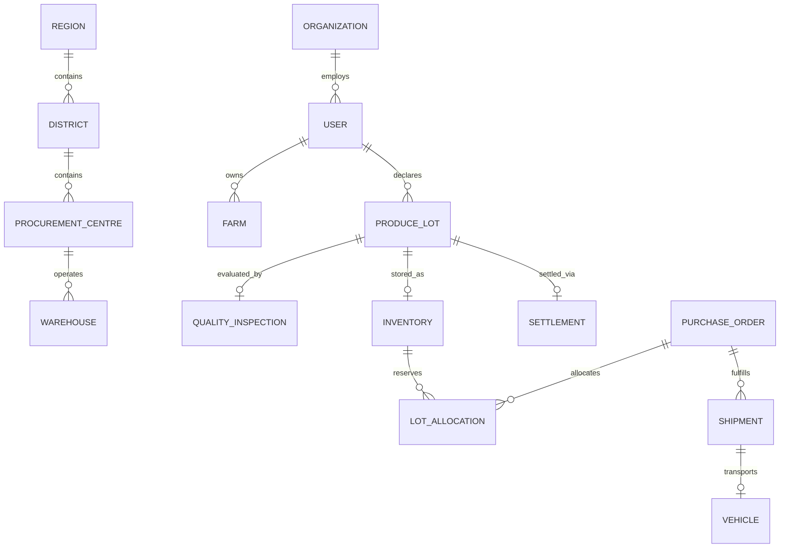

# AGRITRADE — DOMAIN MODEL & STATE MACHINE SPECIFICATION

This document details the core domain entities, canonical schemas, deterministic state machines, and business arithmetic powering the **AgriTrade** platform.

---

## 1. Domain Entity Relationships



---

## 2. Canonical Schemas & Terminology Reconciliation

### 2.1 ProduceLot (`models/ProduceLot.js`)
- `lotNumber`: Unique identifier `MM-YYYY-MM-XXXXXX`
- `farmerId`: Reference to `User`
- `farmId`: Reference to `Farm`
- `cropId`: Reference to `Crop`
- `organizationId`: Optional Reference to `Organization`
- `declaredQuantity`: Initial harvested weight in KG
- `receivedQuantity`: Physical scale weighment at intake
- `acceptedQuantity`: Quality inspector accepted weight
- `rejectedQuantity`: Defective or non-compliant weight
- `agreedPricePerKg`: Persisted procurement price (fallback: `Crop.basePricePerKg`)
- `status`: Lifecycle status (`CREATED` $\dots$ `SETTLED`)
- `qualityInspectionId`: Reference to `QualityInspection`
- `warehouseId`: Reference to `Warehouse`
- `settlementId`: Reference to `Settlement`
- `lifecycleHistory`: Immutable audit log of every transition

### 2.2 Canonical Inventory (`models/Inventory.js`)
Reconciled to eliminate conflicting legacy field names:
- `warehouseId`: Reference to `Warehouse` (canonical)
- `lotId`: Reference to `ProduceLot` (canonical)
- `cropId`: Reference to `Crop`
- `grade`: `GRADE_A` | `GRADE_B` | `GRADE_C` | `REJECTED`
- `totalQuantity`: Total physical weight in storage
- `availableQuantity`: Quantity free for allocation to buyers
- `reservedQuantity`: Quantity committed to approved Purchase Orders
- `storageLocation`: Bin/bay identifier (e.g., `BAY-A-12`)
- `status`: `IN_STOCK` | `DEPLETED` | `QUARANTINED`

### 2.3 PurchaseOrder (`models/PurchaseOrder.js`)
- `poNumber`: Unique identifier `PO-YYYY-XXXXXX`
- `buyerId`: Reference to `User`
- `items`: Line items containing `cropId`, `requiredGrade`, `quantity`, `agreedUnitPrice`, `allocatedQuantity`
- `totalAmount`: Aggregated order value
- `status`: PO Lifecycle status (`DRAFT` $\dots$ `COMPLETED`)
- `allocations`: References to `LotAllocation` records

### 2.4 Settlement (`models/Settlement.js`)
- `settlementNumber`: Unique identifier `SET-YYYY-MM-XXXXXX`
- `farmerId`: Reference to `User`
- `lotId`: Reference to `ProduceLot`
- `acceptedQuantity`: Verified net accepted weight (KG)
- `agreedPricePerKg`: Base agreed price
- `effectiveRatePerKg`: Base rate multiplied by quality bonus/penalty
- `grossAmount`: `acceptedQuantity × effectiveRatePerKg`
- `deductions`: Itemized array (`MOISTURE_PENALTY`, `HANDLING_CHARGES`, etc.)
- `adjustments`: Itemized array (`PREMIUM_GRADE_BONUS`, `INCENTIVE`, etc.)
- `netAmount`: `grossAmount - totalDeductions + totalAdjustments`
- `paymentStatus`: `PENDING` | `PROCESSING` | `COMPLETED` | `FAILED`

---

## 3. The 3 Distinct State Machines

AgriTrade maintains strict separation between **Produce Lot State**, **Purchase Order State**, and **Shipment State**.

### 3.1 Produce Lot Lifecycle
```text
CREATED
  ↓
SCHEDULED
  ↓
RECEIVED
  ↓
UNDER_INSPECTION
  ↓
ACCEPTED / PARTIALLY_ACCEPTED / REJECTED
  ↓
STORED
  ↓
ALLOCATED
  ↓
DISPATCHED
  ↓
DELIVERED
  ↓
SETTLED
```

### 3.2 Purchase Order Lifecycle
```text
DRAFT
  ↓
SUBMITTED
  ↓
UNDER_REVIEW
  ↓
APPROVED / REJECTED
  ↓
PARTIALLY_ALLOCATED / FULLY_ALLOCATED
  ↓
READY_FOR_DISPATCH
  ↓
PARTIALLY_DISPATCHED / DISPATCHED
  ↓
PARTIALLY_DELIVERED / DELIVERED
  ↓
COMPLETED (or CANCELLED)
```

### 3.3 Shipment & Logistics Lifecycle
```text
PLANNED
  ↓
READY_FOR_DISPATCH
  ↓
DISPATCHED
  ↓
IN_TRANSIT
  ↓
ARRIVED / DELAYED
  ↓
DELIVERED (or CANCELLED)
```

---

## 4. Business Arithmetic

### 4.1 Quality Grading
Calculated objectively from physical metrics:
- Base Quality Score: 100
- Moisture penalty: `-(moisture - 12) * 4` (if $> 12\%$)
- Foreign matter penalty: `-(foreignMatter * 8)`
- Broken grains penalty: `-(brokenGrains * 3)`
- Grain damage penalty: `-(damage * 6)`

Grade Thresholds:
- **Grade A**: Score $\ge 85$, Moisture $\le 13\%$, Foreign Matter $\le 1\%$ (Multiplier: $1.05$)
- **Grade B**: Score $\ge 70$, Moisture $\le 15\%$, Foreign Matter $\le 2.5\%$ (Multiplier: $1.00$)
- **Grade C**: Score $\ge 50$, Moisture $\le 18\%$, Foreign Matter $\le 4\%$ (Multiplier: $0.88$)
- **Rejected**: Score $< 50$ or excessive spoilage (Multiplier: $0.00$)

### 4.2 Settlement Formula
$$\text{Effective Rate} = \text{Agreed Price} \times \text{Grade Multiplier}$$
$$\text{Gross Amount} = \text{Accepted Quantity} \times \text{Effective Rate}$$
$$\text{Net Settlement} = \text{Gross Amount} - \sum \text{Deductions} + \sum \text{Adjustments}$$
All calculations are server-authoritative and rounded to 2 decimal places.
