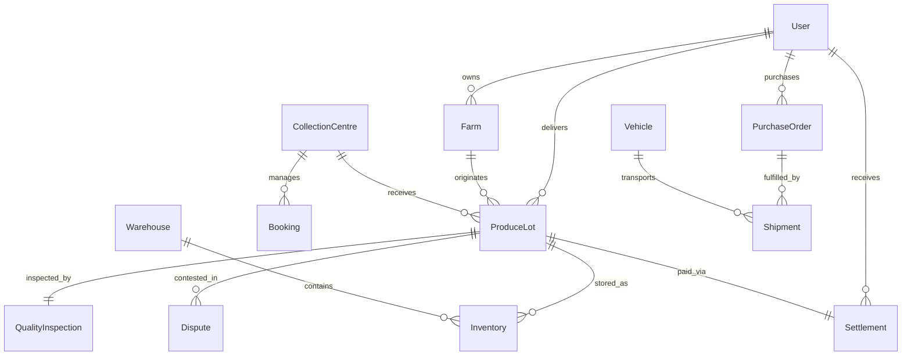

# MANDI MITHRA — Database Schema Specification

---

### Core Data Models Summary

---

### 1. `users` (User Authentication & Profiles)
| Field | Type | Description |
|---|---|---|
| `_id` | ObjectId | Primary Key |
| `fullName` | String | Full legal name |
| `phoneNumber` | String | Unique index, mandatory for OTP login |
| `email` | String | Unique index, optional for farmers, required for buyers/admins |
| `role` | Enum | `FARMER`, `QUALITY_INSPECTOR`, `CENTRE_MANAGER`, `DISTRICT_OFFICER`, `SUPER_ADMIN`, `BUYER`, `LOGISTICS_COORDINATOR` |
| `centreId` | ObjectId | Reference to `CollectionCentre` (for centre staff) |
| `districtId` | ObjectId | Reference to `District` (for district staff) |
| `active` | Boolean | Account status |

---

### 2. `farms` (Farmer Acreage & Land Records)
| Field | Type | Description |
|---|---|---|
| `_id` | ObjectId | Primary Key |
| `farmerId` | ObjectId | Reference to `User` (`role: FARMER`) |
| `farmName` | String | Name/identifier of the farm |
| `surveyNumber` | String | Official land revenue survey number |
| `totalAreaAcres` | Number | Total land area in acres |
| `cropsGrown` | Array | References to `Crop` with historical yield |
| `location` | GeoJSON | `{ type: "Point", coordinates: [lng, lat] }` |

---

### 3. `producelots` (Produce Lot Aggregate & State Machine)
| Field | Type | Description |
|---|---|---|
| `_id` | ObjectId | Primary Key |
| `lotNumber` | String | Unique formatted ID (e.g., `LOT-2026-0001`) |
| `farmerId` | ObjectId | Reference to `User` |
| `farmId` | ObjectId | Reference to `Farm` |
| `cropId` | ObjectId | Reference to `Crop` |
| `centreId` | ObjectId | Reference to `CollectionCentre` |
| `declaredQuantity` | Number | Quantity declared by farmer (kg) |
| `grossQuantity` | Number | Gate scale recorded gross weight (kg) |
| `acceptedQuantity` | Number | Quantity approved by quality inspector (kg) |
| `rejectedQuantity` | Number | Quantity rejected due to defects (kg) |
| `assignedGrade` | Enum | `GRADE_A`, `GRADE_B`, `GRADE_C`, `REJECTED` |
| `status` | Enum | `CREATED`, `INSPECTION_PENDING`, `INSPECTING`, `ACCEPTED`, `PARTIALLY_ACCEPTED`, `REJECTED`, `STORED`, `ALLOCATED`, `DISPATCHED`, `DELIVERED`, `SETTLED`, `CANCELLED` |
| `auditHistory` | Array | `[{ status, changedBy, timestamp, reason, metadata }]` |

---

### 4. `qualityinspections` (Laboratory & Visual Inspection Records)
| Field | Type | Description |
|---|---|---|
| `_id` | ObjectId | Primary Key |
| `lotId` | ObjectId | Reference to `ProduceLot` |
| `inspectorId` | ObjectId | Reference to `User` |
| `moisturePercentage` | Number | Recorded moisture % |
| `foreignMatterPercentage` | Number | Impurity and foreign matter % |
| `defectivePercentage` | Number | Immature, damaged, or discolored grains % |
| `sampleWeightGrams` | Number | Total laboratory test sample weight |
| `qualityScore` | Number | Calculated index ($0-100$) |
| `assignedGrade` | Enum | Final determined grade |
| `isAccepted` | Boolean | True if accepted for storage |
| `remarks` | String | Inspector field notes |

---

### 5. `warehouses` & `inventory` (Storage & Physical Tracking)
#### `warehouses`
| Field | Type | Description |
|---|---|---|
| `name` | String | Warehouse facility name |
| `code` | String | Unique code (e.g. `WH-HYD-01`) |
| `totalCapacityKg` | Number | Total storage volume in kg |
| `usedCapacityKg` | Number | Currently occupied volume in kg |
| `centreId` | ObjectId | Associated Mandi Collection Centre |

#### `inventory`
| Field | Type | Description |
|---|---|---|
| `warehouseId` | ObjectId | Reference to `Warehouse` |
| `lotId` | ObjectId | Reference to `ProduceLot` |
| `cropId` | ObjectId | Reference to `Crop` |
| `grade` | String | Produce Grade |
| `quantity` | Number | Initial lot batch quantity |
| `availableQuantity` | Number | Unallocated free quantity |
| `reservedQuantity` | Number | Quantity held for open POs |
| `status` | Enum | `AVAILABLE`, `RESERVED`, `ALLOCATED`, `DISPATCHED`, `EXHAUSTED` |
| `binLocation` | String | Warehouse section / bay / rack identifier |

---

### 6. `purchaseorders` (B2B Procurement Contracts)
| Field | Type | Description |
|---|---|---|
| `poNumber` | String | Formatted PO code (e.g., `PO-2026-0001`) |
| `buyerId` | ObjectId | Reference to `User` (`role: BUYER`) |
| `status` | Enum | `DRAFT`, `SUBMITTED`, `UNDER_REVIEW`, `APPROVED`, `REJECTED`, `ALLOCATED`, `PARTIALLY_ALLOCATED`, `IN_TRANSIT`, `DELIVERED`, `COMPLETED`, `CANCELLED` |
| `items` | Array | `[{ crop, grade, quantityKg, targetPricePerKg, allocatedLots: [{ lotId, quantityKg }] }]` |
| `totalQuantityKg` | Number | Aggregated order quantity |
| `totalValue` | Number | Total monetary purchase value |
| `deliveryAddress` | Object | Full destination delivery address |

---

### 7. `shipments` & `vehicles` (Logistics Execution)
#### `vehicles`
| Field | Type | Description |
|---|---|---|
| `registrationNumber` | String | Vehicle license plate number |
| `vehicleType` | Enum | `SMALL_TRUCK`, `MEDIUM_TRUCK`, `HEAVY_TRUCK`, `TRAILER` |
| `capacityKg` | Number | Max rated payload capacity |
| `driverName` | String | Driver full name |
| `driverPhone` | String | Driver mobile number |

#### `shipments`
| Field | Type | Description |
|---|---|---|
| `shipmentNumber` | String | Unique Shipment Code (e.g., `SHP-2026-0001`) |
| `purchaseOrder` | ObjectId | Reference to `PurchaseOrder` |
| `vehicle` | ObjectId | Reference to `Vehicle` |
| `sourceWarehouse` | ObjectId | Reference to `Warehouse` |
| `status` | Enum | `DRAFT`, `READY_FOR_DISPATCH`, `DISPATCHED`, `IN_TRANSIT`, `OUT_FOR_DELIVERY`, `DELIVERED`, `CANCELLED` |
| `dispatchedAt` | Date | Timestamp of gate departure |
| `deliveredAt` | Date | Timestamp of delivery confirmation |
| `estimatedArrivalDate` | Date | Planned delivery schedule (ETA) |
| `deliveryConfirmation` | Object | `{ receiverName, receivedWeightKg, remarks, signatureDate }` |

---

### 8. `settlements` (Farmer Payout Vouchers)
| Field | Type | Description |
|---|---|---|
| `settlementNumber` | String | Unique Voucher Code (e.g., `SET-2026-0001`) |
| `lotId` | ObjectId | Reference to `ProduceLot` |
| `farmerId` | ObjectId | Reference to `User` |
| `acceptedQuantityKg` | Number | Approved quantity |
| `basePricePerKg` | Number | Base mandi rate / MSP |
| `gradeMultiplier` | Number | Quality price adjustment |
| `grossAmount` | Number | Total gross payout |
| `deductions` | Object | Itemized cess and weighing fees |
| `netAmount` | Number | Net payable amount |
| `paymentStatus` | Enum | `PENDING`, `PROCESSING`, `PAID`, `FAILED` |
| `disbursedAt` | Date | Bank release timestamp |

---

### 9. `disputes` (Grievances & redressed discrepancies)
| Field | Type | Description |
|---|---|---|
| `disputeNumber` | String | Grievance code |
| `raisedBy` | ObjectId | Reference to `User` |
| `entityType` | Enum | `ProduceLot`, `PurchaseOrder`, `Shipment`, `Settlement` |
| `entityId` | ObjectId | Polymorphic reference to target entity |
| `reason` | String | Categorized dispute cause |
| `status` | Enum | `RAISED`, `UNDER_INVESTIGATION`, `RESOLVED`, `REJECTED` |
| `resolution` | String | Final binding administrative determination |
